

  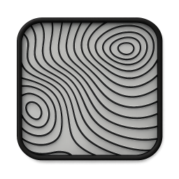

<h1 align="center">Xherpa – IT Dashboard for macOS</h1>

  A lightweight macOS IT dashboard providing system visibility, diagnostics, and local access to support tools.

---

## Overview

**Xherpa** provides a unified local interface for macOS diagnostics, compliance checks, and IT resources — all without elevated permissions or cloud dependencies.  
It’s ideal for managed or air-gapped environments where transparency and consistency are key.

---

## Page Overview

### 🏠 Quick Links
The main hub for IT portals, service links, and documentation.  
Each button is configurable and can be rebranded for internal use.

  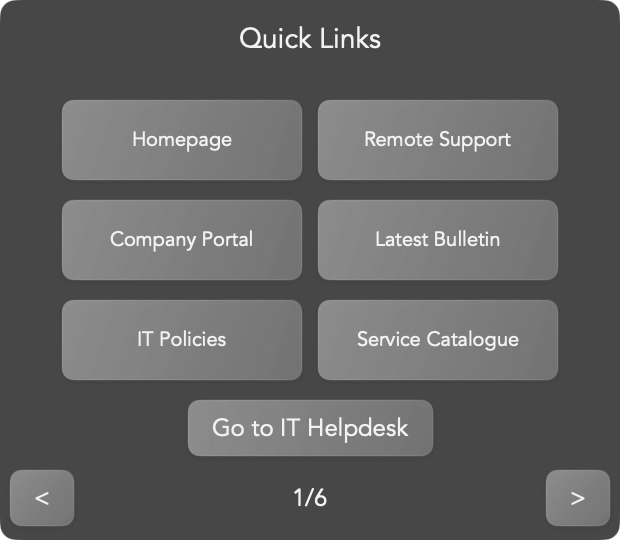

---

### 💻 System Info
Displays live system details like hostname, macOS version, uptime, RAM, and disk usage.  
Helps identify performance or environment issues instantly.

  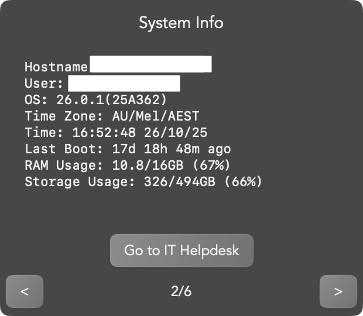

---

### 🔒 Security Status
Summarises FileVault, SIP, Gatekeeper, MDM enrolment, and admin accounts.  
All values are gathered from safe, read-only macOS utilities.

  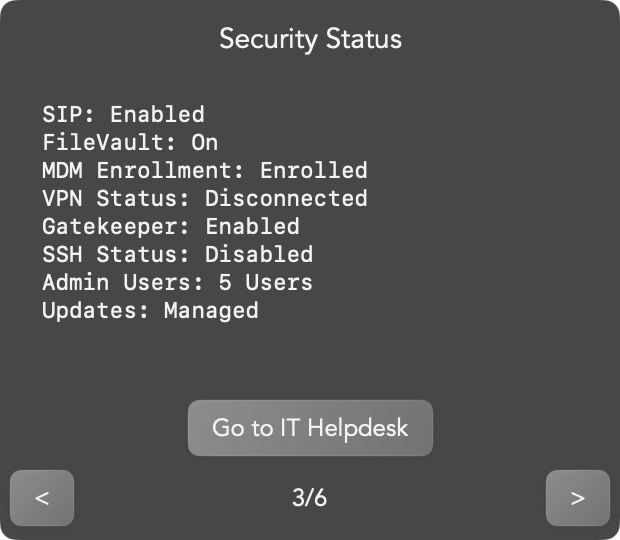

---

### 🌐 Network
Displays active interface, DNS, gateway, and basic connectivity tests.  
Uses `networksetup`, `ping`, and `scutil` to validate local and external reachability.

  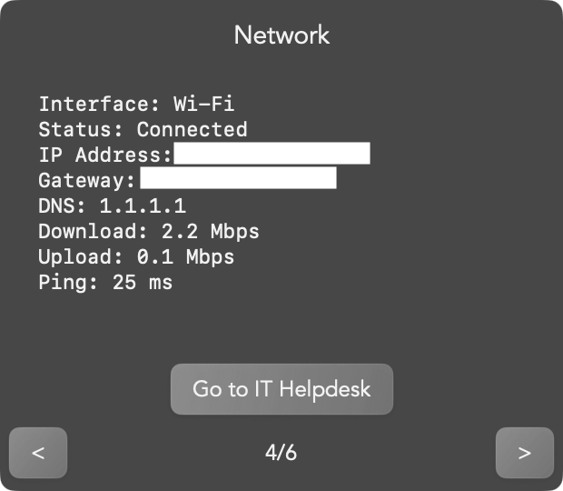

---

### 🧰 Utilities
Local diagnostic tools that run entirely in user space — fast, safe, and private.

  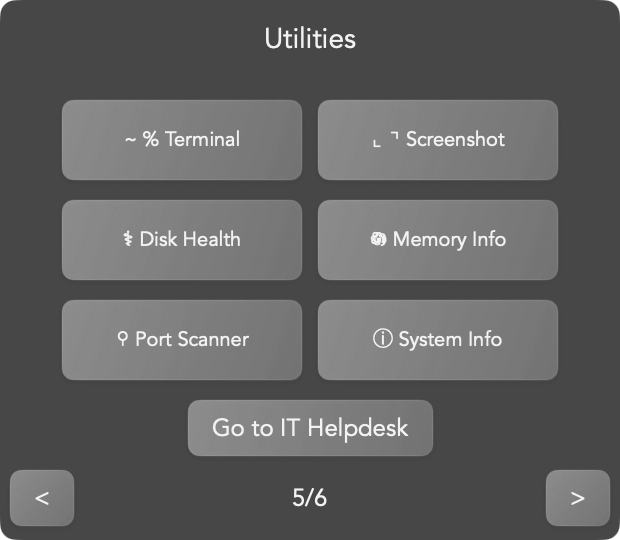

#### **Available Utilities**
| Tool | Description |
|------|--------------|
| **Terminal** | Opens macOS Terminal for advanced commands. |
| **Screenshot** | Launches macOS’s built-in screenshot utility. |
| **Disk Health** | Analyses volume layout, APFS health, and mount status. |
| **Memory Info** | Displays live memory distribution and system pressure. |
| **Port Scanner** | Verifies local and external network service reachability. |
| **System Info** | Opens macOS System Information for in-depth reporting. |

##### **Disk Health**
Checks APFS containers, available space, Spotlight status, and mount state using `diskutil`.  
Displays clear indicators for health and accessibility.

  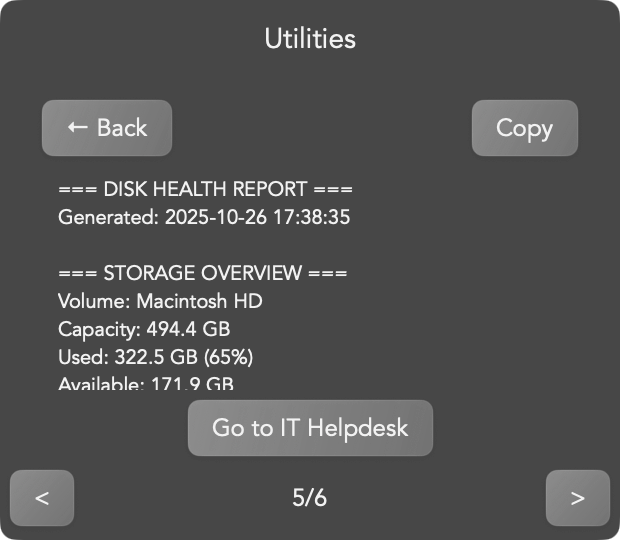

##### **Memory Info**
Uses `vm_stat` and internal metrics to show total, active, compressed, and wired memory.  
Highlights memory pressure and available resources.

  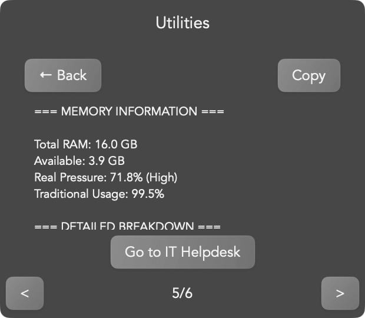

##### **Port Scanner**
Tests local and external ports (HTTP, HTTPS, DNS, SMTP, etc.) and reports connectivity results.  
Confirms DNS and gateway responsiveness in real time.

  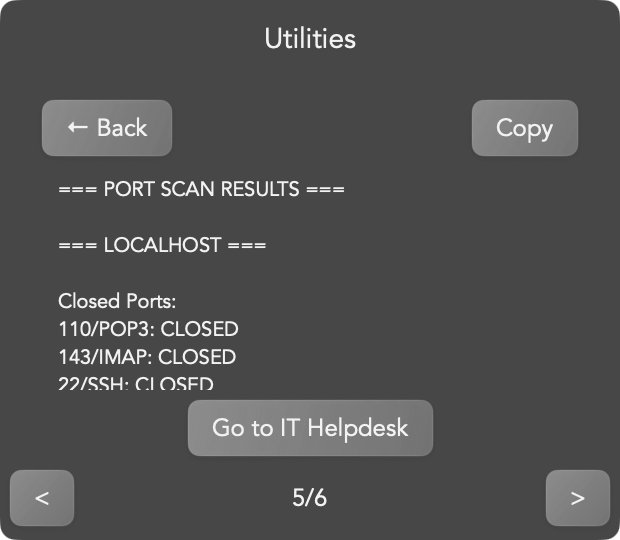

---

### 🎨 Appearance
Complete visual customisation through Xherpa’s built-in theme engine.

**Features**
- **Choose Skin:** load from built-in professional presets  
- **Customise:** adjust colour palettes and depth  
- **Randomise:** instantly shuffle theme combinations  
- **Save Skin:** persist preferred layouts for future sessions  

  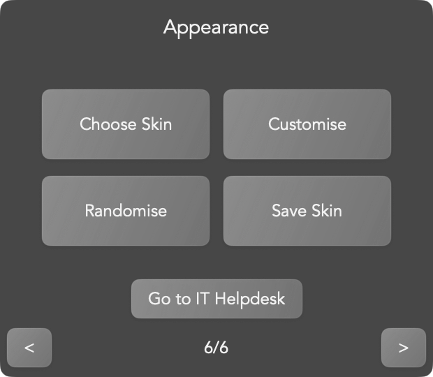

#### Theme Variations

  
  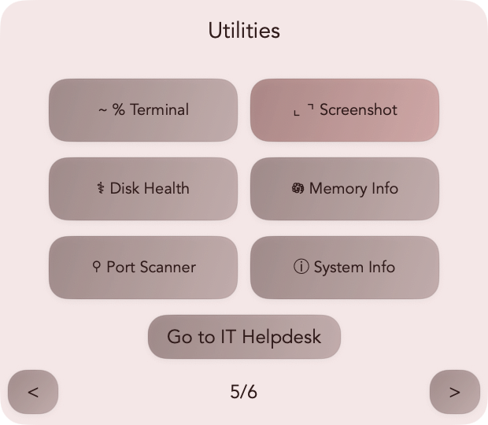 
  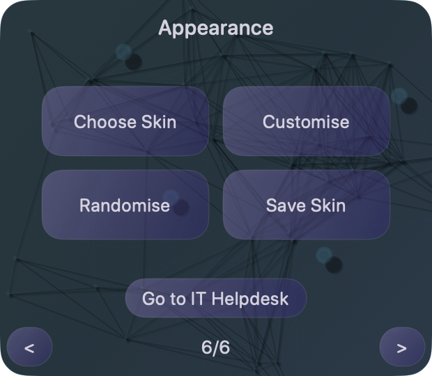
  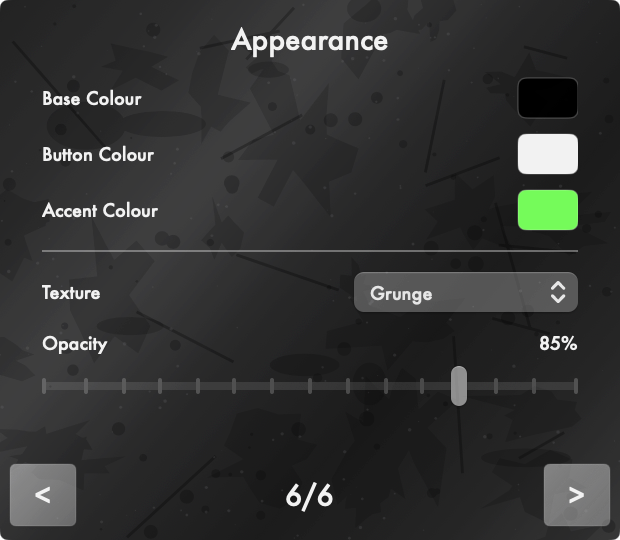 
  
   
  
   
  

The UI features **physics-based behaviour** — windows can be “thrown” across the screen, bounce off edges, and subtly resize while moving.  
This motion logic adds a tactile, lightweight feel that makes Xherpa distinct from static IT dashboards.

---

## Technology Stack

| Layer | Technologies | Description |
|-------|--------------|-------------|
| **UI** | SwiftUI + AppKit bridge | Native, modular macOS interface |
| **Diagnostics** | Swift Concurrency + Process wrappers | Executes system utilities asynchronously |
| **Data Handling** | Codable JSON | Local-only, no telemetry |
| **Animation & Physics** | Core Animation | Real-time, physics-based UI motion |
| **Theming** | Dynamic colour palette | Randomisable and persistent |
| **Build** | Xcode Universal Binary | Unsigned, non-notarised `.app` |

---

## Security & Privacy

- Local execution only  
- No telemetry or external calls  
- Read-only system queries  
- Safe for MDM-managed Macs  
- Fully offline operation  

---

## Development Notes

- **Platform:** macOS 12.0+  
- **Architecture:** Universal (Intel + Apple Silicon)  
- **Size:** ≈4.5 MB  
- **Memory Usage:** ≈10 MB  
- **Notarisation:** Unsigned — internal/demo use  

---

## Contact

For documentation or collaboration:  
**cypherhunk@protonmail.com**

---

*Xherpa is distributed for demonstration and educational purposes only.*  
*The app is unsigned and not notarised for App Store distribution.*
