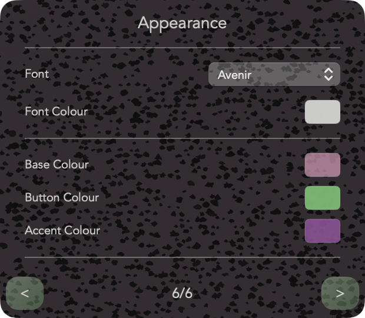
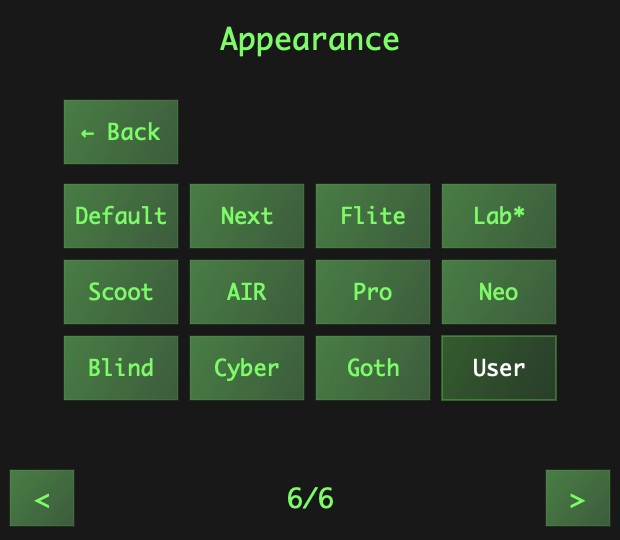
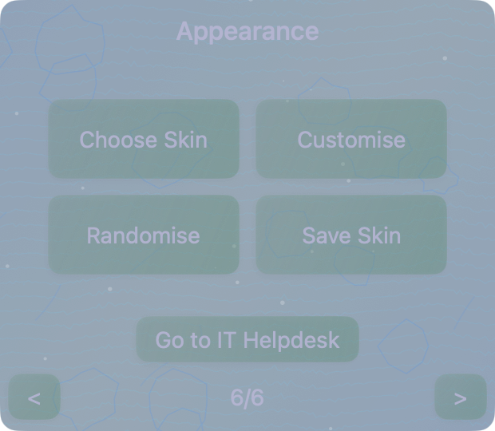
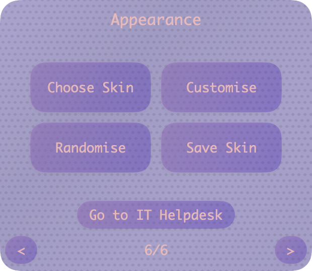
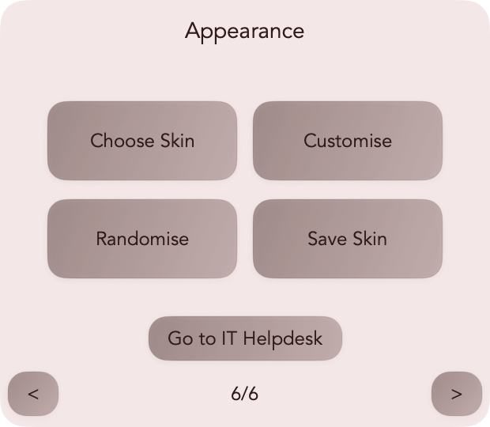

  

<h1 align="center">Xherpa – IT Dashboard for macOS</h1>

  A lightweight macOS IT dashboard providing system visibility, diagnostics, and local access to support tools.

---

## Overview

**Xherpa** is a standalone macOS dashboard for system diagnostics, compliance visibility, and IT access, without elevated permissions or cloud dependencies.  
It is designed for managed and offline environments that demand clarity, reliability, and simplicity.

---

## Page Overview

### Quick Links
The entry point of the dashboard, providing one-click access to company portals, support documentation, and remote assistance tools.  
All links are configurable and can be rebranded for internal use.

  

---

### System Info
Displays core system information at a glance, including hostname, OS version, uptime, memory and storage usage, and timezone.  
This allows users and IT staff to quickly assess performance and system health.

  

---

### Security Status
Summarises macOS security and compliance configuration, including SIP, FileVault, Gatekeeper, MDM enrolment, and user privileges.  
All data is retrieved from system-safe, read-only commands.

  

---

### Network
Provides live network diagnostics showing interface status, DNS, and measured latency.  
IP and gateway addresses are masked in screenshots for privacy.  
Checks are performed locally using `networksetup`, `ping`, and `scutil`.

  

---

### Utilities
A local toolset providing on-demand diagnostics and quick access to native macOS tools.  
All modules operate in user mode; no administrative privileges are required.

  

#### Available Utilities
| Utility | Description |
|----------|-------------|
| Terminal | Opens the macOS Terminal for manual commands. |
| Screenshot | Launches the built-in macOS Screenshot utility. |
| Disk Health | Analyses APFS layout, free space, and filesystem health. |
| Memory Info | Reports current memory pressure, allocation, and usage. |
| Port Scanner | Verifies network connectivity and service availability. |
| System Info | Opens the native System Information app. |

##### Disk Health
Checks APFS containers, capacity, Spotlight status, and recent error logs using `diskutil`.  
Reports volume health and filesystem accessibility.

  

##### Memory Info
Uses `vm_stat` and system metrics to provide real-time breakdowns of active, inactive, wired, and compressed memory.  
Includes pressure indicators and recommendations when utilisation is high.

  

##### Port Scanner
Tests key local and external ports (HTTP, HTTPS, DNS, SMTP, and others) to confirm full connectivity.  
Validates DNS resolution, gateway responsiveness, and outbound service reachability.

  

---

### Appearance
A fully customisable interface layer allowing live theming, skin randomisation, and user preset saving.  
Themes are designed for clarity and subtle contrast, suitable for both light and dark workspaces.

**Features**
- Choose Skin – load from built-in visual presets  
- Customise – adjust colour, gradient, and depth  
- Randomise – instantly shuffle theme combinations  
- Save Skin – store personalised themes for reuse  

  

#### Theme Variations

  
   
  
   
  
   
  
   

The interface includes a set of lightweight physics-driven behaviours designed to make interaction feel natural and physical rather than static.  
Windows respond to velocity and inertia when dragged, allowing them to be thrown across the screen. They decelerate, bounce off display edges, and subtly deform or resize dynamically while in motion.  
This responsiveness gives Xherpa a tangible sense of weight and motion, combining professional utility with a level of physical realism more often found in creative applications than IT dashboards.

---

## Technology Stack

| Layer | Technologies | Description |
|-------|--------------|-------------|
| UI | SwiftUI + AppKit bridge | Native, modular macOS interface |
| Diagnostics | Swift Concurrency + Process wrappers | Runs asynchronous system queries safely |
| Data Handling | Codable JSON | Local-only storage with zero telemetry |
| Animation and Physics | Core Animation | Real-time, physics-based UI interactions |
| Theming | Dynamic gradient engine | Randomisable colour and depth system |
| Build | Xcode Universal Binary | Unsigned, non-notarised `.app` |

---

## Security and Privacy

- Runs entirely offline  
- No telemetry, tracking, or analytics  
- Read-only system interactions  
- MDM and enterprise-safe  
- Sandboxed operation

---

## Development Notes

- Platform: macOS 12.0+  
- Architecture: Universal (Intel and Apple Silicon)  
- Size: ~4.5 MB  
- Memory Usage: ~10 MB average  
- Distribution: Unsigned `.app`, internal or manual install  

---

## Contact

**cypherhunk@protonmail.com**

---
