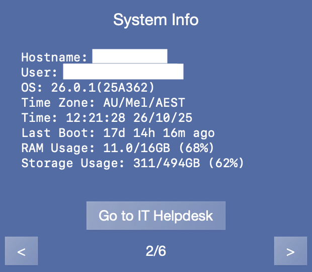

  

<h1 align="center">Xherpa - IT Dashboard for macOS</h1>

  A lightweight, brandable IT dashboard for macOS.  
  Designed for system visibility, diagnostics, and quick IT access.

---

## Overview

xherpa is a macOS application that provides local system diagnostics, compliance checks, and quick access to IT resources — all without requiring admin rights or internet access.  
It’s designed for technical environments where transparency, consistency, and local-only operation are key.

---

## Key Features

### Self-Service Diagnostics
- Real-time system health overview  
- Network connectivity and latency checks  
- Security and compliance validation  
- One-click diagnostic summaries

### IT Access Hub
- Quick access to IT policies and helpdesk portals  
- Remote support shortcuts  
- Configurable launch points for internal tools

### White-Label Ready
- Customisable branding, icons, and colour schemes  
- Adjustable layout modules  
- Optional organisation-specific themes

### Security & Privacy
- No admin privileges required  
- Local-only data handling (no telemetry or cloud storage)  
- Read-only system queries  
- MDM-aware behaviour for managed devices

---

## Internal macOS Tools & Diagnostics

xherpa uses native Apple frameworks and shell utilities for safe, local analysis.

| Category | Tools / Frameworks | Purpose |
|-----------|--------------------|----------|
| **System Health** | `system_profiler`, `ioreg`, `psutil` bridge | Collects hardware, process, and performance data |
| **Network** | `networksetup`, `ping`, `traceroute`, `scutil`, `ifconfig` | Performs network, DNS, and gateway checks |
| **Security & Compliance** | `fdesetup`, `profiles`, `mdmclient`, `csrutil` | Reads FileVault, MDM, and security configuration states |
| **Disk & Memory** | `diskutil`, `df`, `vm_stat` | Gathers storage and memory usage data |
| **Reporting** | Local JSON and Markdown logs | Generates readable diagnostic exports |

All commands are executed in **read-only mode** and are sandboxed to prevent configuration changes.

---

## Technology Stack

xherpa is built natively for macOS using Swift and standard Apple frameworks.

| Layer | Technologies Used | Description |
|-------|-------------------|--------------|
| **UI Layer** | SwiftUI + AppKit bridge | Modern native interface with animated panels and dynamic themes |
| **Diagnostics Engine** | Swift Concurrency + Process wrappers | Runs system utilities and parses structured output |
| **Data Handling** | Codable JSON structures | Local-only storage and exports |
| **Animation & Layout** | Core Animation, GeometryReader | Responsive and fluid macOS-native interface |
| **Theming System** | Dynamic colour palette and gradients | Supports multiple professional themes |
| **Build & Packaging** | Xcode Universal Binary | Unsigned, non-notarised `.app` bundle for manual deployment |

---

## Development Notes

- **Platform:** macOS 12.0+  
- **Binary Size:** ~4.5 MB (Universal Binary)  
- **Memory Footprint:** ~10 MB average  
- **Operation:** Fully offline, local execution  
- **Permissions:** No elevated privileges required  
- **Compatibility:** Intel & Apple Silicon  

---

## Built-in Utilities

  
  
  

---

## Professional Themes

### Theme Variations

  
  

  
  

---

## Feature Gallery

  
  

  
  

  
  

---

## In Action

  
  

---

## Availability

xherpa can be customised for internal or enterprise deployment:

- **Branding** – replace icon, colours, and name  
- **Custom integrations** – link to internal KBs or tools  
- **Extended diagnostics** – add environment-specific scripts  
- **Deployment** – distribute via Jamf, Intune, or manual install  

---

## Contact

For technical documentation or collaboration:  
cypherhunk@protonmail.com

---

*xherpa is distributed for demonstration and educational purposes only.  
The software is not notarised or signed for public macOS distribution.*
